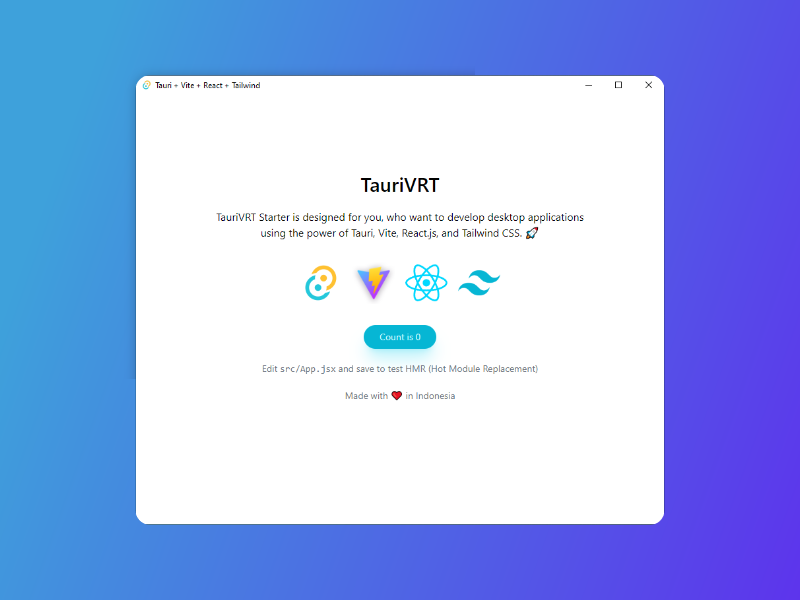

# TauriVRT Starter
## Tauri + Vite + React.js + Tailwind CSS Starter

TauriVRT Starter is designed for you, who want to develop desktop applications using the power of Tauri, Vite, React.js, and Tailwind CSS. 🚀



## Requirements
- #### Tauri
    Tauri requires some prerequisites. You can follow the instructions provided here:  <https://https://tauri.app/v1/guides/getting-started/prerequisites>.
- #### Node.js
    TauriVRT requires **Node.js v16+ to run.**

## Tech Stack
- [Tauri]
- [Vite]
- [React.js]
- [Tailwind CSS]

## Getting Started
## Installation

```
git clone https://github.com/BayuWilanda4L/ubay-taurivrt-starter
```

Install the dependencies and devDependencies and start the server.

```sh
cd ubay-taurivrt-starter

yarn
#or with npm
npm i

#start the server
yarn tauri dev
```

## License

MIT

[//]: # (These are reference links used in the body of this note and get stripped out when the markdown processor does its job. There is no need to format nicely because it shouldn't be seen. Thanks SO - http://stackoverflow.com/questions/4823468/store-comments-in-markdown-syntax)

[Tauri]: <https://tauri.app>
[Vite]: <https://vitejs.dev>
[React.js]: <https://react.dev>
[Tailwind CSS]: <https://tailwindcss.com>
